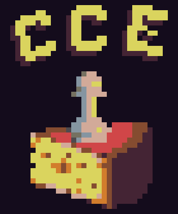

<div align="center">
    <br>
    
    
    
    <h1>Cheese Chess Engine (CCE)</h1>

</div>

> GO TO [NEW REPO](https://github.com/cheese-chess/cheese_chess)

A UCI (not yet) chess engine written in C, join our [Discord server](https://discord.gg/FBzkBQhz3A).

## Dependancies
```
make
```

## Running
It still doesn't even do anything, why would you want to run it??? Anyway:
```bash
# Clone this repo
git clone https://github.com/cheese-chess/cheese_chess
# Go into the repo (duh, if you didn't know that, you shouldn't be compiling software)
cd cheese_c
# Run make to compile
make
# Then run it
make run
# If you want to install it, even if it doesnt do anything, run this as root (using sudo or doas or something, we really don't care):
make install
```

## Credits
- [@aa2006](https://github.com/aa2006) for code.
- [@segfaultdev](https://github.com/segfaultdev) for idk what.
- [@DamieFC](https://github.com/DamieFC) for adding extra to the duh
