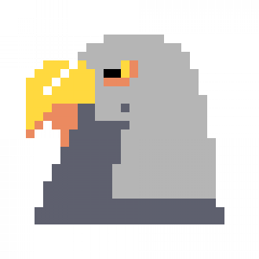

<div align="center">
    <br>
    
    
    
    <h1>Peregrine Chess Engine (PCE)</h1>

</div>

A UCI chess engine written in C.
<br>
> Join our [Discord server](https://discord.gg/FBzkBQhz3A).<br>
> Challenge Peregrine on [Lichess](https://lichess.org/@/PeregrineEngine).

## Installing

### Windows and MacOS
Coming Soon

### Linux
Grab the latest binary from the [releases](https://github.com/aa2006/Perigrine/releases) page and copy it to `/usr/bin`, or [build from source](#build-instructions)

## Dependencies
```
make
```

## Build Instructions

```bash
# Clone the repo
https://github.com/aa2006/peregrine-chess
# Enter the repo directory
cd peregrine-chess
# Run make to compile
make
# To run it...
make run
# To install it...
make install # you may need to run this as root - use sudo/doas as required.
```

## Credits
- [@aa2006](https://github.com/aa2006) for code.
- [@segfaultdev](https://github.com/segfaultdev) for reformatting code.
- [@nekodjin](https://github.com/nekodjin) for updating README.md
- [@DamieFC](https://github.com/DamieFC) for adding extra to the duh
