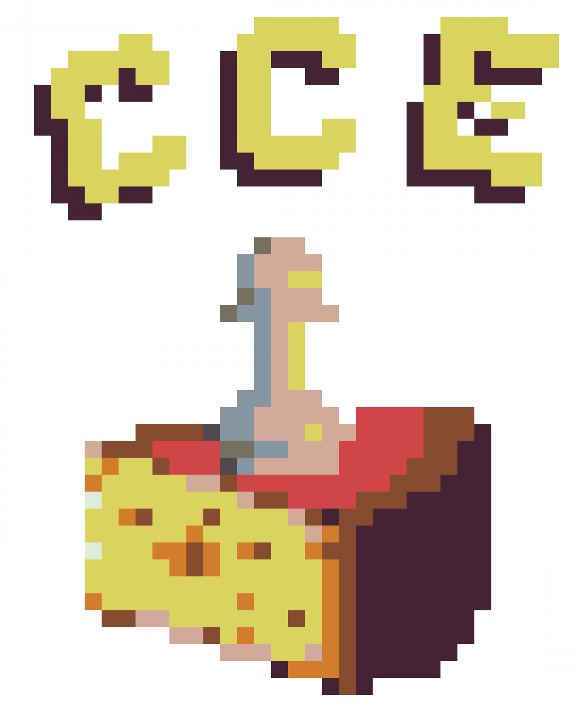

<div align="center">
    <br>
    
    
    
    <h1>Cheese Chess Engine (CCE)</h1>

</div>

A UCI (not yet) chess engine written in C.
<br>
Join our [Discord server](https://discord.gg/FBzkBQhz3A).

## Dependencies
```
make
```

## Build Instructions
#### Note: This project doesn't do anything yet.
```bash
# Clone the repo
git clone https://github.com/cheese-chess/cheese_chess
# Enter the repo directory
cd cheese_c
# Run make to compile
make
# To run it...
make run
# To install it...
make install # you may need to run this as root - use sudo/doas as required.
```

## Credits
- [@aa2006](https://github.com/aa2006) for code.
- [@segfaultdev](https://github.com/segfaultdev) for idk what.
- [@DamieFC](https://github.com/DamieFC) for adding extra to the duh
